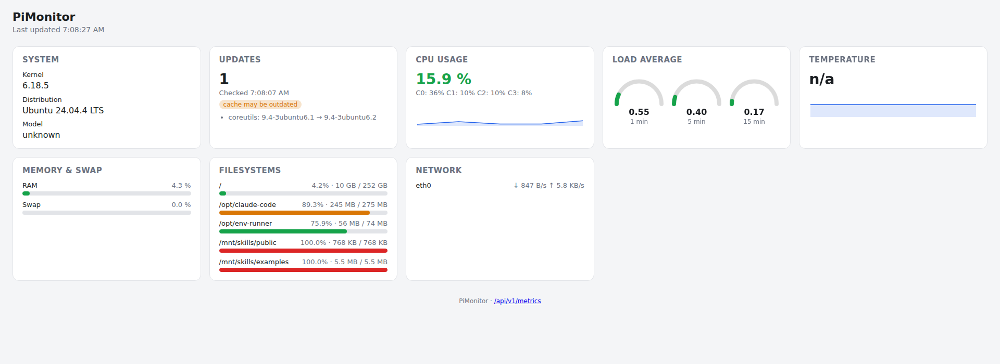

# PiMonitor

A lightweight system-monitoring dashboard for the Raspberry Pi. A single
Go binary collects system metrics, serves a self-contained web dashboard,
and exposes a versioned REST API for third-party integration (e.g. home
automation systems like openHAB). Runs as a systemd service.



## Features

- **CPU usage** - overall and per-core percentage, with a trend sparkline
- **Load average** - 1/5/15 minute values shown as gauges, scaled to CPU
  core count
- **CPU temperature** - auto-detected thermal zone, with an optional
  `vcgencmd`-sourced GPU temperature if available
- **Memory & swap** usage
- **Filesystem usage** - per mounted filesystem, pseudo filesystems
  (tmpfs, proc, overlay, ...) excluded by default
- **Network throughput** per interface (optional, can be disabled)
- **System identity** - kernel version, OS distribution, Raspberry Pi
  model
- **Uptime** - device clock and time since boot
- **Available apt updates** - count and package list, with a staleness
  indicator for the underlying apt cache
- Short metric history (default: last 60 minutes) for sparklines,
  periodically snapshotted to a compact binary file so it survives
  restarts and reboots - no database
- **Light/dark theme toggle** - follows the OS setting by default, with a
  manual override remembered in the browser
- A versioned REST API (`/api/v1/...`) for third-party consumers, with
  optional API-key authentication - see [`docs/API.md`](docs/API.md)

## Architecture

```
                  ┌─────────────────────────────┐
                  │        pimonitor (Go)       │
                  │                             │
 /proc, /sys ───▶ │  collector  ──▶  httpapi   │───▶ Web dashboard
 apt cache        │  (in-memory          │      │     (embedded assets)
                  │   ring buffers)      ▼      │
                  │                 /api/v1/... │───▶ Third-party clients
                  └─────────────────────────────┘        (e.g. openHAB)

 pimonitor.service          pimonitor-apt-update.timer (root)
 runs unprivileged    <--   refreshes apt cache every 6h;
 reads /proc, /sys,         pimonitor itself never needs
 and the apt cache          root privileges
 read-only
```

The main service (`pimonitor.service`) never requires root: it only reads
world-readable files under `/proc`, `/sys/class/thermal`,
`/etc/os-release`, and the apt cache, plus the read-only
`apt list --upgradable` command. A separate, root-privileged systemd timer
(`pimonitor-apt-update.timer`) refreshes the apt cache periodically -
see [`SECURITY.md`](SECURITY.md) for the full threat model.

## Building

Requires Go 1.22+.

```sh
make build          # native build, for local development -> bin/pimonitor
make build-arm64     # cross-compile for 64-bit Raspberry Pi OS (Pi 3/4/5)
make build-arm       # cross-compile for 32-bit / Pi Zero/1 (GOARM=6)
make test            # go test ./...
make lint             # golangci-lint (also enforced in CI)
```

`make run` starts the server locally against
`packaging/pimonitor.example.yaml` - useful for frontend/API development on
a non-Pi machine. Hardware-specific metrics (e.g. CPU temperature) simply
report as unavailable rather than failing.

Pre-built binaries for tagged releases are published via GitHub Actions
using [goreleaser](https://goreleaser.com/) - see the
[Releases](https://github.com/larslaskowski/pimonitor/releases) page.

## Installing on a Raspberry Pi

### 1. Download and extract the release

On the Pi, download the release tarball matching your Raspberry Pi OS and
extract it. Release assets are named
`pimonitor_<version>_linux_<arch>.tar.gz`, with `<arch>` being:

- `arm64` - 64-bit Raspberry Pi OS (Pi 3/4/5)
- `armv6` - 32-bit Raspberry Pi OS, or any Pi Zero/1

The snippet below fetches the latest version automatically via the GitHub
API, so you only need to set `ARCH`:

```sh
ARCH=arm64   # or armv6, see above

VERSION=$(curl -fsSL https://api.github.com/repos/larslaskowski/pimonitor/releases/latest | grep -m1 '"tag_name"' | cut -d '"' -f4)
wget "https://github.com/larslaskowski/pimonitor/releases/download/${VERSION}/pimonitor_${VERSION#v}_linux_${ARCH}.tar.gz"
tar xzf "pimonitor_${VERSION#v}_linux_${ARCH}.tar.gz"
cd "pimonitor_${VERSION#v}_linux_${ARCH}"

ls
# install.sh  pimonitor  pimonitor.service  pimonitor-apt-update.service
# pimonitor-apt-update.timer  pimonitor.example.yaml  README.md  LICENSE.md
```

Alternatively, pick a specific version and architecture manually from the
[Releases](https://github.com/larslaskowski/pimonitor/releases) page. Either
way you get a single `pimonitor_<version>_linux_<arch>/` directory containing
everything the installer needs — the binary (named plainly `pimonitor`),
`install.sh`, and the systemd units. Run the remaining steps from inside that
directory.

### 2. (Optional) Customize the configuration before installing

`install.sh` never overwrites an existing `/etc/pimonitor/config.yaml` -
it only writes one if none exists yet. If you want to start with
non-default settings (for example a different `listen_addr` because port
`8080` is already used by something else on the Pi) instead of editing
the config and restarting afterwards, stage it yourself *before* running
`install.sh`:

```sh
sudo mkdir -p /etc/pimonitor
sudo cp pimonitor.example.yaml /etc/pimonitor/config.yaml
sudo nano /etc/pimonitor/config.yaml   # e.g. change listen_addr
```

This matters in particular for `listen_addr`: if the configured port is
already in use, `pimonitor.service` fails to bind it and keeps
crash-looping (`Restart=on-failure`, retried every 5s) - but
`install.sh` itself reports success and prints no error, because
`systemctl enable --now` returns immediately without waiting to see
whether the service actually stays up. Always verify the service is
running after installing, see step 4.

### 3. Run the installer

```sh
sudo ./install.sh
```

Run it from inside the extracted directory (see step 1). The installer picks
up the `pimonitor` binary sitting next to it automatically — no path argument
needed.

This creates an unprivileged `pimonitor` system user, installs the binary
to `/usr/local/bin/pimonitor`, writes a default config to
`/etc/pimonitor/config.yaml` (if one doesn't already exist), installs the
two systemd units, and enables/starts both. Because the config file may
contain the `api_key` secret, the installer keeps it readable only by root
and the `pimonitor` group (`/etc/pimonitor` is `750 root:pimonitor`, the
config file `640 root:pimonitor`) — re-running `install.sh` also tightens
the permissions of an existing config without touching its content. See
[`packaging/pimonitor.example.yaml`](packaging/pimonitor.example.yaml) for
every configuration option.

If you are installing from a source checkout instead of a release archive
(so there is no pre-built binary next to the script) and have a Go toolchain
installed directly on the Pi, `install.sh` builds one for you:

```sh
sudo ./packaging/install.sh
```

### 4. Verify the installation

```sh
systemctl status pimonitor.service pimonitor-apt-update.timer
journalctl -u pimonitor -f
```

A successful install shows `active (running)` for `pimonitor.service`.
If instead you see `activating (auto-restart)` or a growing restart
count, the process is crash-looping on startup (a busy `listen_addr`
port is the most common cause). Check the actual error with
`journalctl -u pimonitor -n 50`, fix `/etc/pimonitor/config.yaml`
accordingly, then apply it with:

```sh
sudo systemctl restart pimonitor.service
```

The dashboard is then available at `http://<pi-address>:8080/` (or
whatever port you configured).

## Updating

PiMonitor is distributed as a single binary, so upgrading is a matter of
replacing that binary and restarting the service. `install.sh` is safe to
re-run for this purpose: it overwrites the binary and the systemd units but
leaves an existing `/etc/pimonitor/config.yaml` untouched.

1. **Get the new version.** Either download the binary (or release tarball)
   for your architecture from the
   [Releases](https://github.com/larslaskowski/pimonitor/releases) page, or
   pull the latest source and cross-compile it (`make build-arm64` /
   `make build-arm`).

2. **Re-run the installer** from inside the newly extracted release directory:

   ```sh
   sudo ./install.sh
   ```

   This replaces `/usr/local/bin/pimonitor`, refreshes the systemd units, and
   runs `systemctl daemon-reload`. Your configuration is preserved.

3. **Restart the service** so the running process picks up the new binary.
   `install.sh` starts the units but does not restart an already-running
   service, so do it explicitly:

   ```sh
   sudo systemctl restart pimonitor.service
   ```

   If the `pimonitor-apt-update.timer` or its service unit changed, also run
   `sudo systemctl restart pimonitor-apt-update.timer`.

4. **Verify** the new version is running:

   ```sh
   pimonitor -version
   systemctl status pimonitor.service
   journalctl -u pimonitor -n 20
   ```

Because nothing is persisted across restarts (the in-memory history is
rebuilt from scratch), the sparklines will simply start empty again after an
update — there is no database to migrate.

**New configuration options:** upgrades never modify your existing
`config.yaml`. When a release adds settings, compare your file against the
current
[`packaging/pimonitor.example.yaml`](packaging/pimonitor.example.yaml) and
copy over any new keys you want to use. All settings have sensible defaults,
so a config from an older version keeps working unchanged.

**REST API compatibility:** the `/api/v1/...` contract is stable across
updates — a breaking change to an endpoint's JSON shape ships as
`/api/v2/...` instead, so existing integrations (e.g. openHAB) keep working
after an upgrade. See [`docs/API.md`](docs/API.md).

## REST API

See [`docs/API.md`](docs/API.md) for the full contract, including an
example openHAB HTTP Binding configuration. Quick example:

```sh
curl -s http://raspberrypi.local:8080/api/v1/metrics | jq '.cpu.overall_percent'
```

## Configuration

All settings have sensible defaults; override via `/etc/pimonitor/config.yaml`
(see [`packaging/pimonitor.example.yaml`](packaging/pimonitor.example.yaml))
or CLI flags (`-listen`, `-log-level`, `-api-key`, `-config`, `-version`).
Flags take precedence over the config file, which takes precedence over
built-in defaults.

## Development

See [`CLAUDE.md`](CLAUDE.md) for build/test conventions and project
structure notes. Contributions are welcome - see the issue and pull
request templates under `.github/` for what to include.

## License

[MIT](LICENSE.md)
