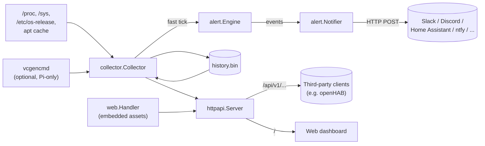

# Architecture

This document describes how PiMonitor is put together and, where the reasoning is
recoverable from the code, comments, or existing docs, *why* it looks the way it does.
It complements [`README.md`](../README.md) (features, build, install), [`CONTRIBUTING.md`](CONTRIBUTING.md)
(workflow), [`TESTS.md`](TESTS.md) (test conventions), [`API.md`](API.md)
(REST API contract), and [`SECURITY.md`](../SECURITY.md) (threat model) rather than
repeating them.

---

## High-level shape



PiMonitor ships as a **single statically-linked Go binary** (`cmd/pimonitor`) with no
runtime dependencies beyond the target Linux kernel — no database, no separate frontend
build, no container runtime. It runs as one systemd service (`pimonitor.service`) that
does everything: metric collection, alert evaluation, webhook delivery, and serving both
the REST API and the dashboard's static assets from the same `net/http` server.

A second, separate systemd unit (`pimonitor-apt-update.timer`) runs as root and refreshes
the apt package cache on a schedule; `pimonitor.service` itself never needs elevated
privileges. This privilege split is the central security design decision of the project —
see [Privilege separation](#privilege-separation-and-deployment) below and
[`SECURITY.md`](../SECURITY.md).

## Process wiring (`cmd/pimonitor/main.go`)

`run()` is the composition root: it resolves configuration, then constructs and wires
together the following collaborators before starting anything:

1. `config.Load` — resolves `Config` from built-in defaults, an optional YAML file, and
   CLI flags (see [Configuration](#configuration)).
2. `alert.NewNotifier` — builds the webhook notifier from `cfg.Alerts`; returns `nil` with
   no error when no webhooks are configured, so the rest of the code can treat a `nil`
   `*Notifier` as "notifications disabled" without a separate feature flag.
3. `collector.New` — builds the `Collector`, wiring in the notifier and the alert engine
   configuration.
4. `web.Handler` — returns an `http.Handler` serving the embedded dashboard assets.
5. `httpapi.New` — builds the `Server`, given the collector (as a narrow
   `MetricsProvider` interface) and the static handler.

The collector and the HTTP server then run as two goroutines under a shared
`signal.NotifyContext(SIGINT, SIGTERM)`. On shutdown, `server.Shutdown` is given a 10s
grace period, and `main` waits for the collector's own shutdown path (which performs one
final history flush, see [History persistence](#history-persistence)) to finish — bounded
by the same shutdown context, so a stuck flush cannot hang the process indefinitely.

## Metric collection (`internal/collector`)

`Collector` (`collector.go`) owns one sub-collector struct per metric family — `cpu`,
`cpuFreq`, `loadAvg`, `memory`, `disk`, `network`, `temp`, `throttled`, `sysInfo`,
`updates`, `uptime` — each in its own file (`cpu.go`, `memory.go`, ...) with a `Collect()`
method that reads `/proc`/`/sys` (or shells out to `vcgencmd`/`apt` where no `/proc`/`/sys`
source exists) and returns a typed value plus an error. Every one of these parsers is
built to be unit-testable against fixture strings rather than real `/proc`/`/sys` access —
see [`TESTS.md`](TESTS.md).

**Two independent tickers** drive collection, both started immediately on `Run` and then
on their own interval:

- **Fast tick** (`fastTick`, default every `poll_interval_seconds` = 5s): CPU usage/load
  average/temperature/throttling/memory/swap/disk/network. Every sub-collector's error is
  logged and does *not* abort the tick — a failure in one metric (e.g. no thermal zone on
  non-Pi hardware) leaves that field at its zero value for this snapshot rather than
  blocking the others.
- **Slow tick** (`slowTick`, default every `updates_check_minutes` = 15 min): available
  apt updates. This is deliberately much less frequent than the fast tick because the
  underlying apt cache is itself only refreshed every 6h by the separate root-privileged
  timer — polling it every 5s would be pure overhead.

**Snapshot + history, guarded by one `sync.RWMutex`.** `Collector.latest` holds the most
recent value of every metric (`Snapshot()` returns a copy under `RLock`); each scalar
metric additionally feeds a `RingBuffer[HistoryPoint]` (`History()` returns a copy of
every buffer's contents). Per-device metrics (disk, network) use a
`map[string]*RingBuffer[HistoryPoint]` keyed by mountpoint/interface name, created lazily
the first time a given device is seen. `RingBuffer[T]` (`ringbuffer.go`) is a fixed-
capacity circular buffer with its own internal lock — safe to read concurrently with the
collector's own tick, independent of the collector's outer `sync.RWMutex`.

Entries are also removed: `evictStaleSeries`, called from `fastTick` for `diskHist`,
`rxHist`, and `txHist`, deletes a device's series once its *newest* sample is older than
the retained history window (`FastInterval * HistoryCapacity`) — without this, a churning
`veth*` interface from container start/stop or a USB drive that gets unplugged would keep
its full ring buffer (and keep showing up in `GET /api/v1/metrics/history`) forever. This
deliberately differs from the alert engine's `pruneDisks` (see below), which drops state
on a single absent sample: `DiskCollector.Collect` already skips a mountpoint that
transiently fails to stat, so evicting history on the first miss would wipe a device's
history over a passing blip rather than an actual disappearance — eviction is tied to the
history window instead, so a one-tick miss is tolerated and only a sustained absence is
treated as gone.

`HistoryCapacity` (`config.Config.HistoryCapacity()`) is derived from
`history_window_minutes / poll_interval_seconds`, not configured directly, and is capped
at 1,000,000 points per series (`config.maxHistoryCapacity`) — `NewRingBuffer` allocates
its capacity eagerly, so an extreme window/interval ratio from a config typo (e.g.
`history_window_minutes: 525600` with `poll_interval_seconds: 0.05`) would otherwise
allocate on the order of gigabytes at startup and OOM a Pi. `Config.Validate()` rejects
such a ratio at startup rather than letting it crash later.

## History persistence (`internal/collector/persist.go`)

When `history_persist_enabled` is true (the default), the collector periodically
snapshots all history buffers to a single file (`<data_dir>/history.bin`) so sparklines
survive service restarts and reboots, without a database. The format ("PIMH v1") is a
small hand-rolled binary encoding: a 4-byte magic, a version, then one record per metric
series (scalar or per-device) with little-endian timestamps (Unix milliseconds) and
IEEE-754 float64 values. Decoding enforces hard limits on series count, key length, and
points per series so a corrupt or malicious file cannot trigger an oversized allocation.

- **Written**: on every `slowTick` (i.e. every `updates_check_minutes`) and once more on
  clean shutdown (`ctx.Done()` in `Run`), so a clean stop loses at most the points
  collected since the last fast tick.
- **Written asynchronously**: `persistHistory` snapshots `Collector.History()` on the
  calling goroutine (a consistent point-in-time view), then hands the encode-and-write off
  to a background goroutine tracked by `Collector.persistWG`. On a Pi the atomic write's
  `fsync` can stall the SD card for hundreds of milliseconds, and `Run`'s `time.Ticker`
  drops rather than queues any fast tick that falls due meanwhile — running the write
  inline on the tick goroutine would silently punch a hole in the very history being
  persisted. A buffered try-lock (`Collector.persisting`) skips — rather than queues — a
  flush while a previous write is still in flight, since the next flush writes newer data
  anyway. `Run`'s `ctx.Done()` branch calls `persistWG.Wait()` after the final
  `persistHistory()` so the last flush is guaranteed to land before `Run` returns; this is
  bounded by `cmd/pimonitor/main.go`'s shutdown context (it selects on `collDone` vs.
  `shutdownCtx.Done()`), so a stuck fsync cannot hang the process.
- **Written atomically**: `writeFileAtomic` writes to a temp file in the same directory,
  `fsync`s it, then renames it over the target path — a crash mid-write can never leave a
  partially written history file behind.
- **Read on startup** (`loadHistory`): a missing file is normal (first start) and silent;
  a present-but-corrupt or unreadable file is logged and ignored, and the collector simply
  starts with empty history rather than failing to start. Restored points older than
  `history_window_minutes` are trimmed on load (`importHistory`).
- **Versioned, not migrated**: unknown series kinds are skipped on decode (forward
  tolerance for old binaries reading a file written by a newer one that only adds series
  kinds), but any change to the record layout itself must bump `historyVersion` rather
  than attempt an in-place migration — there is intentionally no migration path, since the
  data is disposable derived state (it can always be dropped and rebuilt from scratch).

## Alert engine (`internal/alert/alert.go`)

`alert.Engine` turns each fast-tick snapshot into per-metric `ok`/`warn`/`crit` states
plus a rolling list of `fired`/`cleared` transition events, served via
`GET /api/v1/alerts`. It is fed synchronously from inside `Collector.fastTick`, while it
holds its own separate mutex — this is safe because the engine never calls back into the
collector, so evaluating it while the collector's own lock is held cannot deadlock.

**Debounce is the core design element.** A raw threshold crossing does not immediately
change the reported state; it must persist for `alerts.for_seconds` before being promoted,
so a single-sample spike shorter than the window never fires an event, and — applied
symmetrically — a momentary dip during a sustained alert never clears it either. The warn
and crit boundaries are tracked as two *independent* timers per metric
(`metricState.warnSince` / `critSince`) rather than one raw ok/warn/crit band, so a value
oscillating in and out of the crit band while staying continuously above the warn cutoff
still correctly fires a warn alert instead of having its debounce window reset every time
it crosses back out of crit.

**Invalid samples never corrupt state.** Each metric in a `Sample` carries a `*Valid`
flag; when collection fails for a metric on a given tick (e.g. a disk read error), that
metric is skipped entirely for that evaluation rather than being evaluated against a
bogus zero value — this prevents a transient collection error from spuriously clearing a
real alert. A skipped metric simply keeps whatever state it last had.

**Disks are pruned, not garbage-collected implicitly.** Because disks are a dynamic,
per-mountpoint set, `pruneDisks` explicitly removes alert state for any mountpoint absent
from the latest (valid) sample — e.g. an unmounted USB drive — and emits a final
synthetic `cleared` event if that mountpoint was still alerting, so a vanished filesystem
can't leave a permanently "stuck" alert in the report.

The value-to-level cutoffs (`value >= crit` → crit, `value >= warn` → warn) are the same
`>=` comparison the dashboard's frontend (`app.js`'s `levelClass`) uses for card coloring,
so the server-reported alert state always agrees with what the dashboard visually shows.

## Alert delivery (`internal/alert/notify.go`)

`alert.Notifier` POSTs alert transition events to zero or more configured HTTP webhooks
(Slack, Discord, Home Assistant, ntfy, or any endpoint accepting a JSON/templated body).
Delivery is fully decoupled from collection: `Notify` only enqueues events and returns
immediately; background worker goroutines (`Start`/`dispatch`) drain the queues and
perform the actual (retrying, potentially slow) HTTP calls. This guarantees a hung or
failing webhook endpoint can never stall the collector's fast tick — if a queue fills up
(a persistent backlog of slow deliveries), further events are dropped with a logged
warning rather than blocking.

**Each webhook gets its own bounded queue (`defaultNotifyQueueSize` = 256) and its own
worker** (`webhookWorker`). Delivery to one destination is therefore never held up by
another: a webhook pointing at a dead host can only delay — and only ever drop — its own
events. `Notify` applies the severity filter inline (it is pure and cheap) and fans the
event out onto the queue of every webhook it reaches.

Per-webhook behavior: a severity filter (`min_level`), an optional
`text/template`-rendered body (defaulting to a fixed JSON payload when unset), retry with
exponential backoff up to `notify_max_retries`, and a per-`(metric, resource)`
rate limiter (`notify_min_interval_seconds`) that coalesces repeated firings.

`text/template` does no escaping of its own, so a custom template whose body is JSON must
use the `json` template function (registered in `templateFuncs`) around every interpolated
value — e.g. `{"text": {{json .Message}}}` — rather than embedding it inside a quoted string
literal. `json` marshals the value and supplies its own surrounding quotes, so a resource
string containing a quote or backslash (e.g. an unusual mountpoint) can't produce a
malformed request body. Because `json` supplies its own quotes, it must wrap the *whole*
string value: literal text has to be composed into the value with `printf`
(`{{json (printf "PiMonitor: %s" .Message)}}`) rather than concatenated around the
`json` action, or the literal quotes and the helper's quotes nest into invalid JSON.

**Only retryable failures consume the retry budget.** Transport errors (DNS, refused
connections, timeouts) and 5xx responses are transient, as are `408 Request Timeout` and
`429 Too Many Requests`, which explicitly invite a retry. Every other 4xx is a permanent
rejection of that exact request — a revoked webhook URL, a malformed payload — so
`deliver` gives up after the first attempt instead of re-POSTing an identical body that
cannot succeed. `cleared`
events deliberately bypass the rate limiter — a recovery signal must always reach a
state-based consumer (e.g. a Home Assistant `binary_sensor`) so it can never get stuck
reporting an alert that has actually cleared; only repeated *firings* are coalesced.

## HTTP layer (`internal/httpapi`)

`httpapi.Server` wraps a single `http.ServeMux` behind two distinct middleware layers
(`server.go`, `middleware.go`): a pair of wrappers around the whole mux, and a longer
chain (`apiRoute`) applied to each route that asks for it — every `/api/v1/...` handler,
plus `GET /metrics` when `prometheus_enabled` is set:

```
global:            withLogging(withSecurityHeaders(mux))
per apiRoute:      withNoStore(withMaxInFlight(withGzip(withAPIKey(handler))))
```

`/healthz` and the static dashboard assets only pass through the global layer — that is
exactly why they are the routes not gated by `withAPIKey`, not rate-limited by
`withMaxInFlight`, and not marked uncacheable by `withNoStore`.

The route set itself lives in one place: `routeTable` in `routes.go`, which records each
route's method, path, whether `apiRoute` wraps it, and an optional predicate deciding
whether the running configuration registers it at all. `New` registers from that table,
`routeBucket` classifies request paths against it, and `newServerStats` pre-populates its
counters from it. Those three used to be separate lists, and a route added to only the
first got no bucket of its own: its requests fell into whichever shared fallback matched
the path — `other-api` under `/api/v1/`, `static` otherwise — so
`GET /api/v1/serverstats` misattributed them. That is how `GET /metrics` scrapes came to
be counted as dashboard-asset traffic. The per-metric sub-resources are part of that
same table: they are generated from `metricsSubResources` (also `routes.go`), a list of
snapshot field name/accessor pairs that `routeTable` is built by appending, so each one
gets its route, its middleware chain and its own counter bucket from a single entry —
and, because the accessor returns the snapshot field itself, its response can never
become a second representation of a metric that drifts from `GET /api/v1/metrics`.
Bucketing deliberately ignores the
predicate, so the response shape does not vary with configuration and a request to a
disabled route is still visible under its own key with a matching `4xx` — the bucket
comes from the request path, not from which handler (or the mux's `404` fallback) served
the request.

- **`withSecurityHeaders`**: sets a strict `Content-Security-Policy` (`default-src
  'self'`, no inline scripts/styles), `X-Content-Type-Options: nosniff`,
  `X-Frame-Options: DENY`, and `Referrer-Policy: no-referrer` on every response. The CSP
  can be this strict specifically because the dashboard is fully self-contained — all
  scripts/styles are same-origin embedded files and the favicon is a `data:` URI, hence
  the narrow `img-src 'self' data:'` allowance.
- **`withLogging`**: via a `statusRecorder` wrapper that captures the status code a
  downstream handler wrote (not otherwise exposed by `http.ResponseWriter`), always
  records the request in `serverStats` (`serverstats.go`) — total count, response status
  class, and route, bucketed by `routeBucket` (against `routeTable`, above) to keep the
  counter set a fixed size regardless of what path a client requests — and, when `cfg.AccessLogEnabled` is true
  (the default), also logs method/path/status/duration at debug level. Setting
  `access_log_enabled: false` in the config file silences the debug line while leaving
  the counters, served via `GET /api/v1/serverstats`, unaffected — see issue #43.
- **`withAPIKey`**: gates every route behind `apiRoute` (but not `/healthz`, so external
  health checks work regardless of auth configuration) when `cfg.APIKey` is set. The
  provided key (from `X-Api-Key` or `Authorization: Bearer`) and the configured key are
  both SHA-256 hashed before `crypto/subtle.ConstantTimeCompare`, so the comparison runs
  in constant time over a fixed-length digest — this avoids leaking either the key bytes
  or the configured key's *length* through response timing. When `APIKey` is empty (the
  default), every request is allowed — the common case (dashboard on a trusted LAN) stays
  unauthenticated and simple.
- **`withGzip`**: engages only when the request advertises `Accept-Encoding: gzip`; when it
  does, it sets `Content-Encoding: gzip`, drops the now-stale `Content-Length`, and appends
  (`Header.Add`, not `Set`) `Vary: Accept-Encoding` so it doesn't clobber the `Vary` values
  `withNoStore` already set. The underlying `gzip.Writer`s come from a `sync.Pool` rather
  than being allocated per request, since the `/api/v1/...` endpoints are polled every
  few seconds. A client that doesn't negotiate gzip gets an unmodified identity response,
  so `withGzip` stays backwards compatible for naive `/api/v1` consumers — see
  [`API.md`](API.md#compression) for the wire-level contract.
- **`withMaxInFlight`**: wraps every route behind `apiRoute` (not `/healthz` or
  the static dashboard) in a shared semaphore of capacity `defaultMaxInFlight` (16). A
  request beyond the limit gets `503 Service Unavailable` with `Retry-After: 1` instead of
  being queued indefinitely. This bounds worst-case concurrent CPU/memory on a Pi Zero: an
  unauthenticated flood of requests to the history endpoint (the most expensive one — see
  below) can no longer multiply without limit. `/healthz` is deliberately excluded so a
  monitoring system can still tell the process is alive while the API is shedding load.
- **`withNoStore`**: sets `Cache-Control: no-store` plus `Vary: Authorization` /
  `Vary: X-Api-Key` on every route behind `apiRoute`, outermost in the chain so the
  headers land before anything downstream writes (including on a `401` from `withAPIKey`).
  Metric/alert/config responses are point-in-time and, when `cfg.APIKey` is set,
  credential-protected — a shared cache such as a reverse proxy fronting the Pi must not
  retain them or hand an authorised response to an unauthorised client. `withGzip` uses
  `Header.Add` rather than `Header.Set` for its own `Vary` value so it appends to, rather
  than clobbers, the `Vary` values `withNoStore` already set.

**Routes** (every exact-path route below comes from `routeTable`; the catch-all does
not): `GET /healthz` (plain-text liveness, never
gated), the versioned, API-key-gated routes — `GET /api/v1/metrics`,
`GET /api/v1/metrics/history`, `GET /api/v1/alerts`, `GET /api/v1/config`,
`GET /api/v1/serverstats`, plus one per-metric sub-resource of the snapshot
(`GET /api/v1/metrics/cpu`, `/temperature`, `/memory`, `/disks`, `/network`,
`/updates`) — and `GET /metrics`, registered only when
`prometheus_enabled` is set but gated the same way, plus `GET /` serving the embedded
dashboard via the `staticHandler` passed into `New` (`nil` in tests, to exercise the API
layer without the frontend). See [`API.md`](API.md) for the
full response schemas.

`/healthz` is a liveness check, not just a process-alive probe: `handleHealthz`
(`handlers.go`) also compares `now - MetricsProvider.Snapshot().Timestamp` against
`Config.HealthzMaxStaleness` and returns `503` when the latest snapshot is older than
that bound — e.g. the collector goroutine has stalled while the HTTP server is still
serving requests. `Config.HealthzMaxStaleness` is zero (the check disabled) unless the
caller sets it; `main.go` always sets it from
`config.Config.HealthzMaxStaleness(collector.WorstCaseTickOverhead)`.

Left at its default (`healthz_max_staleness_seconds: 0`), that bound is `3 *
poll_interval_seconds + 2 * collector.WorstCaseTickOverhead`, not just the poll
interval alone: `Collector.fastTick` (`collector.go`) publishes `latest.Timestamp`
only when a tick *completes*, sequentially running collectors that themselves
degrade via timeout rather than fail fast — `TemperatureCollector`/`ThrottledCollector`
each bound a hung `vcgencmd` call at `vcgencmdTimeout`, `DiskCollector` bounds a
stalled `statfs` at `defaultStatfsTimeout` — so a single legitimately slow tick can
already take `collector.WorstCaseTickOverhead`, and the timestamp visible right
before the *next* tick publishes can lag by up to twice that. Ignoring this would
make `/healthz` flap unhealthy on a Pi whose only problem is slow firmware calls,
exactly the failure mode `internal/config` cannot compute for itself: it cannot
import `collector` (which already imports `config` for `Thresholds`), so `main.go`
is where the two are combined.

**`MetricsProvider` is a narrow interface** (`Snapshot() / History() / HistoryGeneration()
/ Alerts()`) implemented by `*collector.Collector`, so `httpapi` can be unit-tested
against a fake implementation (see `handlers_test.go`) entirely independent of real
`/proc`/`/sys` access — the same testability principle the collector package applies to
its own parsers.

**`handleHistory` caches its encoded response.** `Collector.History()` deep-copies every
retained ring buffer under lock — the most expensive request the service serves — but the
underlying data only changes once per `fastTick`. `Collector.HistoryGeneration()` returns
a counter bumped each `fastTick`; `Server` keeps the last generation it encoded alongside
the encoded bytes and reuses them whenever the generation is unchanged, so concurrent
pollers between ticks share one deep-copy-and-encode instead of each paying for their own.

**`handleHistory` serves deltas via `?since=`.** Caching removes the repeated work between
ticks, but not the far larger cost of resending a window the client already holds: at the
default settings that is several thousand points serialised and gzipped once a minute per
poller. `?since=<RFC 3339 timestamp>` reduces the response to the points strictly newer
than that timestamp (`collector.History.Since`), which turns the dashboard's steady-state
poll into a few hundred bytes. Omitting the parameter returns the full window unchanged,
so the parameter is additive and `/api/v1` stays compatible (an unparseable value is a
`400` rather than a silent fallback to the full window, which would hide a broken client
from itself). Because history points are stored oldest first, filtering is a prefix cut
found by binary search (`dropPrefix`, shared with `importHistory`'s window trim), and the
cached deep copy is re-sliced rather than copied again — so the full-window encoding is
only built when something actually asks for the full window.

**`GET /api/v1/config`** exists specifically so the frontend doesn't have to duplicate
values (poll interval, alert thresholds, feature toggles) that are already defined
server-side; it also echoes back the build-time `version` injected via
`-ldflags -X main.version=...`. `ClientConfig.Thresholds` is `config.Thresholds` itself
(carrying both `yaml:` and `json:` tags), not a second, hand-copied struct — a threshold
added to the config file automatically reaches this endpoint with no field-by-field
mapping to keep in sync. Only `internal/web/assets/app.js`'s client-side fallback
defaults (rendered before this endpoint resolves) still duplicate the key set by
necessity; a test in `internal/web` guards that copy against drift via reflection over
`config.Thresholds`'s json tags.

## Web dashboard (`internal/web`)

`web.Handler()` embeds `internal/web/assets/*` (`index.html`, `app.js`, `chart.js`,
`gauge.js`, `theme-init.js`, `style.css`) into the binary via `//go:embed` and serves them
with `http.FileServerFS`. There is **no frontend build step** — no bundler, no npm
toolchain, no framework — the assets are plain HTML/CSS/JS shipped as-is, consistent with
the project's "prefer the standard library, minimize dependency surface" philosophy (see
[`CONTRIBUTING.md`](CONTRIBUTING.md)).

Because embedded files carry a zero `ModTime`, `http.FileServerFS` alone would emit no
`Last-Modified`/`ETag` and no `Cache-Control`, forcing a full refetch of every asset on
every page load. `Handler` wraps the file server to set `Cache-Control: no-cache` and a
**per-asset `Etag` derived from that asset's contents** — a SHA-256 of each embedded
file, truncated to 16 bytes and hex-encoded, computed once at construction (the asset set
is fixed at compile time and tiny, so this costs microseconds and no per-request work).
Browsers therefore revalidate with a cheap conditional request (a 304 while the file is
unchanged) and refetch as soon as its bytes change.

The hash replaces an earlier `version`-derived ETag, which was wrong in two ways: it gave
every asset the *same* validator despite each URL being a distinct resource, and it never
changed across builds that share a version string — which is every unversioned `dev`
build, so `make run` served permanently stale JavaScript after an edit (issue #102).

The validator is attached only to a response that actually *is* the hashed asset. Naming
an asset is not enough: `http.FileServerFS` redirects `*/index.html` to `./` and a
trailing slash on a file to its base, and a 404 has no stable identity at all — so a small
`etagWriter` wrapper removes the header again unless the file server settles on `200`,
`206`, or `304` (a 304 must repeat the validator that matched). The header has to be set
*before* delegating, because `http.ServeContent` answers a conditional request from
whatever is already on the writer; stripping it afterwards is what keeps a cacheable 301
or a 404 from carrying a strong validator for a body it does not describe.

**Stored-XSS prevention is enforced by a repository rule, not just convention.**
`internal/web/xss_test.go` (`TestAppJS_NoInnerHTMLInterpolation`) scans `app.js` at test
time and fails the build if any line assigns non-empty content to `.innerHTML` — the only
permitted use is clearing a container (`el.innerHTML = ''`). This exists because the
dashboard builds DOM rows (mountpoints, network interface names) from server-provided
strings; all such dynamic content must go through `document.createElement` +
`textContent` instead of string-concatenated `innerHTML`, which is exactly the class of
bug that produced issue #19 (see the test's own doc comment). Any new dashboard code
touching `app.js` is bound by this same rule, enforced automatically rather than by review
alone.

The dashboard polls `/api/v1/metrics`, `/api/v1/metrics/history`, `/api/v1/config`, and
`/api/v1/alerts` on the interval `/api/v1/config` reports, and colors metric cards using
the same warn/crit cutoffs the server-side alert engine evaluates against (`>=`) — that
coloring is threshold-based, not alert-state-based, and the two should not be conflated:
a card's color follows the raw value on every poll, while the alert engine's own output
(`GET /api/v1/alerts`) is debounced (`alerts.for_seconds`), so a value can be colored
`crit` before the corresponding alert badge lights up. The alert states are surfaced as a
header banner summarizing the worst active level plus a badge on each affected card
(issue #11); `renderAlerts` recomputes both from scratch on every poll — a metric absent
from `states` (e.g. an unmounted filesystem, or alerting disabled server-side) or back at
`ok` simply has nothing recorded for it, so its badge/banner disappears on the very next
render rather than needing separate clear-out logic. When `api_key` is configured, the
dashboard prompts for the key once per browser and persists it in `localStorage`, sending
it as `X-Api-Key` on every subsequent request (see [`SECURITY.md`](../SECURITY.md) for why
this is an accepted trade-off rather than a gap).

History is polled incrementally (issue #112): after an initial full-window fetch the
dashboard passes the timestamp of its newest point back as `?since=` — verbatim, since
re-formatting it through `Date` truncates the sub-millisecond precision and would fetch
that point again on every poll — and appends the delta locally, trimmed to the
`history_window_minutes` the config endpoint reports. Appending is only safe while the
delta lines up with what the browser holds, so `mergeHistory` refuses one that starts
after a gap (points evicted while the tab was hidden), one whose points are not strictly
newer (a restart serving restored, possibly reordered history), or one with an
unparseable timestamp; any refusal — and any failed request — falls back to re-fetching
the full window, and a full window is re-fetched periodically regardless, since no delta
can reveal a history that was replaced rather than appended to.

Polling is paused while the tab is hidden (a `visibilitychange` listener clears the
metrics, history, and alerts timers) and resumed with an immediate refresh when it
becomes visible again — a backgrounded or wall-mounted-display tab would otherwise keep
requesting `/api/v1/metrics`, `/api/v1/metrics/history`, and `/api/v1/alerts` forever,
since browsers only throttle background timers to roughly once a minute rather than
stopping them (issue #111). Each poll function also guards against overlapping requests
with its own in-flight flag, so a slow response (a loaded Pi, flaky Wi-Fi) doesn't let
requests pile up on top of each other.

## Configuration (`internal/config`)

`config.Load` resolves `Config` in strictly increasing precedence: **built-in defaults**
(`Default()`) → **optional YAML file** (`-config`) → **environment**
(`PIMONITOR_API_KEY`) → **CLI flags** (`-listen`, `-log-level`, `-api-key`). The
environment layer exists only for the API key: the `-api-key` flag leaks the secret into
the process list (`/proc/<pid>/cmdline` is world-readable), whereas `PIMONITOR_API_KEY`
can be delivered by systemd's `EnvironmentFile=` from a root-only file, and the config
file itself is kept at mode `640 root:pimonitor` by `install.sh`. An unset *or empty*
`PIMONITOR_API_KEY` changes nothing, mirroring the empty-flag default, so exporting it
blank cannot accidentally turn off an `api_key` set in the file. `Load` delegates to an
unexported `load(args, lookupEnv)` so the precedence rules are testable without mutating
the process environment. YAML decoding uses `KnownFields(true)`, so an unrecognized key
(e.g. a typo like `api_kay`) fails config loading outright at startup instead of silently
falling back to a default that could be security-relevant (e.g. no authentication because
the intended `api_key` was never actually applied).

`Config.Validate()` runs once, after flag/YAML merging, and rejects any value that would
either crash the process later (e.g. a non-positive `poll_interval_seconds`, which would
panic `time.NewTicker`) or silently misbehave (e.g. `history_persist_enabled: true` with
an empty `data_dir`, or a warn threshold above its own crit threshold) — the goal is that
a daemon started with a bad config fails fast at startup with a descriptive error, rather
than failing (or misbehaving) later at an unpredictable point at runtime. `collector.Run`
still defensively clamps a non-positive tick interval to 1s as defense-in-depth, in case a
future caller ever constructs a `collector.Config` without going through `Validate()`.

`-version` short-circuits before validation, so `pimonitor -version` reports the version
even against an otherwise-invalid config file.

## Privilege separation and deployment

The project's central security decision is a **strict split between the unprivileged main
service and a narrowly-scoped privileged helper**, driven by the fact that refreshing the
apt package cache (`apt-get update`) requires root while reading its result
(`apt list --upgradable`) and everything else PiMonitor collects does not:

- **`pimonitor.service`** runs as a dedicated, unprivileged system user. It only reads
  world-readable files under `/proc`, `/sys/class/thermal`, `/etc/os-release`, and the
  existing apt cache, plus the read-only `apt list --upgradable` command and the optional
  `vcgencmd measure_temp` / `vcgencmd get_throttled` commands — all invoked with fixed
  argument lists (never user input interpolated into a shell command), and further
  sandboxed via systemd unit hardening directives.
- **`pimonitor-apt-update.timer`** runs as root, on a schedule (every 6h), and performs
  exactly one action: `apt-get update`. It is not reachable from the web-facing service
  and exposes no other capability.

This is why the two are separate systemd units rather than one privileged service, and
why `install.sh` — the only component that needs elevated privileges — creates the
unprivileged system user, installs both units, and enables/starts both, but never grants
the main service any capability beyond what it needs to read already-world-readable state.
See [`SECURITY.md`](../SECURITY.md) for the full threat model and reporting process.

**Build/release**: `make build-arm64` / `make build-arm` cross-compile
(`CGO_ENABLED=0`, `GOARM=6` for Pi Zero/1) with the version baked in via
`-ldflags -X main.version=...`. Tagged releases (`vX.Y.Z`) are built and published by
GoReleaser (`.goreleaser.yaml`, driven by `.github/workflows/release.yml`): one archive
per `{linux/arm, linux/arm64}` target, each wrapped in a single top-level directory
containing the binary, `install.sh`, the systemd unit files, and `README.md`/`LICENSE.md`
side by side, so installing from a release tarball is always `cd <dir> && sudo
./install.sh`. There is no Docker image and no database — the only artifacts are the
binary and the packaging files it ships next to.

**CI** (`.github/workflows/ci.yml`) runs `go build ./...`, `go vet ./...`,
`go test ./... -race -cover`, and `golangci-lint run` on every push/PR to `main`, plus a
separate cross-compile job (build-only, `arm`/`arm64`) so a target-platform build break is
caught even though the runner itself is `amd64` and cannot execute Pi-only code paths. A
`sonarqube` job (skipped for Dependabot PRs, which don't receive repository secrets)
regenerates coverage as a Go coverage profile and uploads it to SonarCloud together with
the sources, per `sonar-project.properties` at the repo root. A `govulncheck` job runs
`govulncheck ./...` (reachability-based, so it only fails on vulnerabilities actually
reachable from this code) on every push/PR plus a weekly schedule, so a newly-published CVE
against an unchanged codebase is surfaced without waiting for the next commit.
Actions are pinned to commit SHAs (not floating tags) so a compromised or rewritten action
release can't silently change what CI executes; `.github/dependabot.yml` keeps those pins
and `go.mod` dependencies current.
